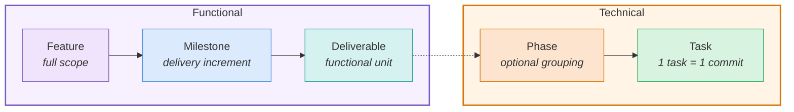
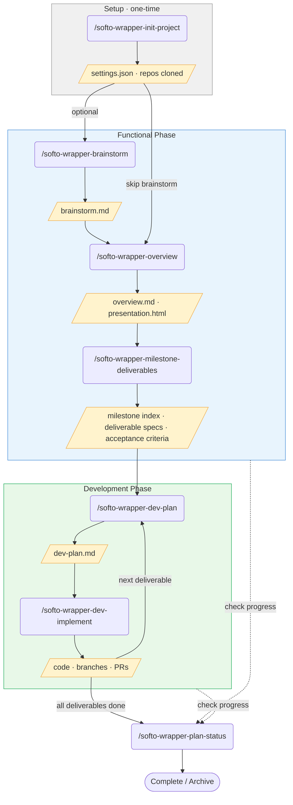

# map-sql-apsis

**Version: 0.1.0**
**Template Version: 0.9.1**

A generic multi-repository wrapper for [Claude Code](https://claude.ai/code). Manage multiple repositories, create feature plans, and generate client-facing documentation — all from a single workspace.

## Features

- **Multi-repo management** — Automatically clones and pulls multiple repositories on session start
- **Two-phase workflow** — Functional planning and development, with automatic phase detection
- **Brainstorming** — Explore problem spaces through structured discussion before formalizing into features
- **Feature planning** — Structured workflow for creating overviews, milestone breakdowns, deliverables, and acceptance criteria
- **Client presentations** — Auto-generated HTML presentations with consistent styling
- **Multi-language support** — Generate documents in multiple languages with proper accents and diacritics
- **Development planning** — Technical dev-plans for each deliverable with codebase analysis
- **Implementation** — Execute dev-plans with branch creation, checklist tracking, and optional auto-commit/PR
- **Slash commands** — `/softo-wrapper-brainstorm`, `/softo-wrapper-overview`, `/softo-wrapper-milestone-deliverables`, `/softo-wrapper-dev-plan`, `/softo-wrapper-dev-implement`, `/softo-wrapper-plan-status`, `/softo-wrapper-bump-version`, `/softo-wrapper-init-project`, and `/softo-wrapper-update-template`

## Hierarchy

Work is organized in five levels, transitioning from functional planning to technical implementation:



| Level | Name | Description | Command | Output artifact |
|-------|------|-------------|---------|-----------------|
| 1 | **Feature** | Full scope of a demand, from start to finish. Contains all milestones. | `/softo-wrapper-overview` | `overview.md` + `presentation.html` |
| 2 | **Milestone** | Delivery increment. By convention, Milestone 1 is the MVP; subsequent milestones add enhancements. | `/softo-wrapper-milestone-deliverables` | `milestone-N-<title>.md` |
| 3 | **Deliverable** | Functional unit described for the client. Input to the development phase. | `/softo-wrapper-milestone-deliverables` | `deliverable-NNNN-<name>-functional.md` + `deliverable-NNNN-<name>-acceptance-criteria.md` |
| — | *Bridge* | *Functional deliverable becomes technical dev-plan. Uses Claude Code's plan mode.* | `/softo-wrapper-dev-plan` | `deliverable-NNNN-<name>-dev-plan.md` (contains phases and tasks) |
| 4 | **Phase** | Optional grouping of tasks within a dev-plan. Used for complex deliverables. | `/softo-wrapper-dev-implement <...> phase-N` | Commits for that phase on `feature/<feature>/<deliverable>` |
| 5 | **Task** | Atomic implementation unit. One task = one commit. Tracked via the dev-plan checklist. | `/softo-wrapper-dev-implement <...> task-N` | Git commit on `feature/<feature>/<deliverable>` |

## Command Flow



## Getting Started

### 1. Initialize your project

```bash
cd ProjectWrapper
claude
```

Then run:

```
/softo-wrapper-init-project
```

This will interactively:
- Ask for your project name, repositories, languages, and pull strategy
- Validate all inputs (including repo accessibility via SSH)
- Remove the wrapper's `.git` directory (the project will be linked to its own repository)
- Update `settings.json` and `README.md`
- Clone all repositories

> **Note:** `/softo-wrapper-init-project` is for new projects only. On subsequent sessions, the session-start hook automatically pulls latest changes for existing repositories.

### 2. Brainstorm (optional)

For vague features or entirely new systems, start with a brainstorm to explore the problem space:

```
/softo-wrapper-brainstorm AI-powered meal planning for busy parents
```

This enters plan mode and facilitates a structured discussion — exploring the real problem, alternative approaches, scope boundaries, and constraints. It generates a lightweight `brainstorm.md` brief that will automatically feed into the next step.

> **Tip:** If you already have a clear vision of the feature, skip this and go directly to step 3.

### 3. Start planning

```
/softo-wrapper-overview Build a user authentication system with social login
```

If a brainstorm exists, pass the feature directory name to pick it up automatically:

```
/softo-wrapper-overview 20260415-meal-planning
```

This enters plan mode, interviews you about the feature, and generates:
- `overview.md` — functional description, goals, how it works, success metrics, and milestones
- `presentation.html` — client-ready HTML presentation
- Translated versions in configured languages

Then break down into deliverables:

```
/softo-wrapper-milestone-deliverables user-authentication all
```

Or for a specific milestone:

```
/softo-wrapper-milestone-deliverables user-authentication milestone-1
```

If there is only one active feature, the feature name is optional:

```
/softo-wrapper-milestone-deliverables all
/softo-wrapper-milestone-deliverables milestone-1
```

### 4. Create a development plan

```
/softo-wrapper-dev-plan user-authentication 0001
```

Or by deliverable name:

```
/softo-wrapper-dev-plan user-authentication login-form
```

This enters plan mode, analyzes all repositories, interviews you about technical decisions, and generates a comprehensive dev-plan for the specified deliverable.

### 5. Implement the plan

```
/softo-wrapper-dev-implement user-authentication 0001
```

Implement a specific phase or task:

```
/softo-wrapper-dev-implement user-authentication 0001 phase-1
/softo-wrapper-dev-implement user-authentication 0001 task-2
```

The command reads the dev-plan, creates branches (`feature/<feature>/<deliverable>`) in impacted repos, implements the code, marks checklist items, and optionally commits and creates PRs.

When `implement.useWorktree` is `true`, implementation happens in isolated git worktrees at `repos/.worktrees/<branch>/<repo>/` instead of switching branches in the main repository. This keeps `repos/<repo>/` on the principal branch for reference and allows working on multiple deliverables simultaneously. Worktrees are cleaned up automatically when a feature is completed via `/softo-wrapper-plan-status complete`.

### 6. Manage features

Check progress anytime:

```
/softo-wrapper-plan-status
```

Mark a feature as completed or archived:

```
/softo-wrapper-plan-status complete 20260401-user-authentication
/softo-wrapper-plan-status archive 20260401-user-authentication
```

### 7. Bump version

```
/softo-wrapper-bump-version 0.2.0
```

This command automatically detects the context via `template.isSource` in `settings.json`:

- **In the template repo** (`template.isSource: true`) — bumps `template.version` in `settings.json` and **Template Version** in `README.md`
- **In a derived project** (`template.isSource: false`) — bumps `version` in `settings.json` and **Version** in `README.md`

The `template.isSource` flag is automatically set to `false` when `/softo-wrapper-init-project` creates a new project.

It also creates an annotated git tag with a functional changelog and pushes it.

### 8. Update template

```
/softo-wrapper-update-template
```

Updates the project wrapper to the latest template version. This command:

- Clones the template repository (from `template.url` in `settings.json`)
- Checks if a newer version is available
- Updates all template-managed files (rules, templates, hooks, skills, CLAUDE.md)
- Merges `settings.json` (adds new fields, removes deprecated ones, keeps your project values)
- Merges `README.md` (updates documentation, keeps your project name and version)
- Preserves project-specific files (`project-functional.md`, `project-development.md`, `features/`, `repos/`)
- Reports any new settings that may need manual configuration

> **Note:** This command only works in derived projects (`template.isSource: false`). The working tree must be clean before running.

## Workflow

This wrapper operates in two phases, automatically detected based on what you're doing:

### Functional Phase

Creating feature overviews, breaking them into milestones, defining deliverables and acceptance criteria. Base instructions are in [`rules/functional.md`](./rules/functional.md).

**Triggers:** using `/softo-wrapper-brainstorm`, `/softo-wrapper-overview`, `/softo-wrapper-milestone-deliverables`, `/softo-wrapper-plan-status`, or editing brainstorm/overview/milestone/deliverable/presentation files.

### Development Phase

Technical planning and implementation of deliverables defined in the functional phase. Base instructions are in [`rules/development.md`](./rules/development.md).

**Triggers:** using `/softo-wrapper-dev-plan`, `/softo-wrapper-dev-implement`, working inside `repos/`, or discussing implementation details.

> **Do not modify `rules/functional.md` or `rules/development.md` in derived projects.** These files are managed by the template and will be overwritten on template updates. Use the project-specific rule files below for customizations.

### Project-Specific Rules

Each phase supports project-specific rules that extend the base template rules:

- [`rules/project-functional.md`](./rules/project-functional.md) — project-specific functional rules
- [`rules/project-development.md`](./rules/project-development.md) — project-specific development rules

These files are loaded alongside the base rules during their respective phases. Add your project's conventions, constraints, and workflows here. **These files are never overwritten by template updates**, so they are the safe place for project-specific customizations. If a project rule conflicts with a base rule, the project rule takes precedence.

### Manual Override

You can explicitly switch phases with `/mode functional` or `/mode dev`.

## Project Structure

```
ProjectWrapper/
├── settings.json            # Repository list and configuration
├── rules/
│   ├── functional.md        # Functional phase rules (template-managed)
│   ├── development.md       # Development phase rules (template-managed)
│   ├── project-functional.md    # Project-specific functional rules
│   └── project-development.md   # Project-specific development rules
├── hooks/
│   └── session-start.js     # SessionStart hook — clones/pulls repos
├── templates/
│   ├── overview.md              # Feature overview template
│   ├── milestone-index.md       # Milestone lean index template
│   ├── deliverable-functional.md    # Deliverable functional spec template
│   ├── acceptance-criteria.md   # Acceptance criteria template
│   └── presentation.html       # HTML presentation base template
├── .claude/
│   ├── settings.json        # Hooks configuration
│   └── skills/              # Slash commands
│       ├── softo-wrapper-brainstorm/            # Explore problem space
│       ├── softo-wrapper-overview/              # Create feature overview
│       ├── softo-wrapper-milestone-deliverables/ # Break milestones into deliverables
│       ├── softo-wrapper-dev-plan/              # Create technical dev-plan
│       ├── softo-wrapper-dev-implement/         # Implement a dev-plan
│       ├── softo-wrapper-plan-status/           # Feature status report
│       ├── softo-wrapper-bump-version/          # Bump wrapper version
│       ├── softo-wrapper-init-project/          # Initialize new project
│       └── softo-wrapper-update-template/       # Update to latest template
├── repos/                   # Cloned repositories (git-ignored)
└── features/
    ├── active/              # In-progress features
    ├── completed/           # Finished features
    └── archived/            # Discarded/obsolete features
```

## Feature Structure

Each feature lives in its own directory under `features/active/`:

```
features/active/20260401-user-authentication/
├── brainstorm.md              # Optional — from /softo-wrapper-brainstorm
├── overview.md
├── presentation.html
├── milestone-1-core-login/
│   ├── milestone-1-core-login.md
│   ├── functional/
│   │   ├── deliverable-0001-login-form-functional.md
│   │   ├── deliverable-0001-login-form-acceptance-criteria.md
│   │   ├── deliverable-0002-password-reset-functional.md
│   │   └── deliverable-0002-password-reset-acceptance-criteria.md
│   └── dev-plans/
│       ├── deliverable-0001-login-form-dev-plan.md
│       └── deliverable-0002-password-reset-dev-plan.md
├── milestone-2-social-login/
│   └── ...
└── pt-BR/
    ├── brainstorm.md
    ├── overview.md
    └── presentation.html
```

When a feature is complete, move its directory to `completed/`. Discarded features go to `archived/`.

## Settings Reference

| Field | Description | Example |
|-------|-------------|---------|
| `version` | Current project version (semver, no `v` prefix) | `"0.1.0"` |
| `template.version` | Template version used to create the project (read-only in projects) | `"0.4.0"` |
| `template.isSource` | Whether this is the template repo (`true`) or a derived project (`false`) | `true` |
| `template.url` | Git URL of the template repository (used by `/softo-wrapper-update-template`) | `"git@github.com:SoftoDev/Softo-ProjectWrapper-ClaudeCode.git"` |
| `languages` | Additional languages for translated documents. English is always the default and does not need to be listed. Empty array means English only. | `["pt-BR"]` |
| `repositories` | List of repositories (name, url) | See above |
| `pull.strategy` | `"rebase"` or `"merge"` | `"merge"` |
| `pull.autoStash` | Auto-stash local changes before pull | `false` |
| `implement.autoCommit` | Automatically commit after each checklist item during implementation | `true` |
| `implement.autoPR` | Automatically create PRs after completing implementation scope | `true` |
| `implement.useWorktree` | Use git worktrees for implementation instead of switching branches in the main repo | `false` |

## Prerequisites

- [Claude Code](https://claude.ai/code) installed
- Node.js (any recent version)
- Git with SSH key configured
